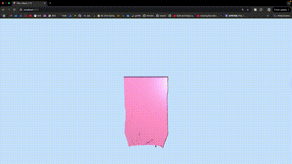

# 🧶 Cloth Simulation using Position-Based Dynamics

This project implements a real-time cloth simulation using **Position-Based Dynamics (PBD)** in a WebGL environment. The simulation is interactive, GPU-accelerated, and rendered using modern web technologies including **Three.js** and **React**.

## 🎬 Demo

▶️ Watch the demo here: 

## 💡 Features

- ⚡ **Real-time simulation** using WebGL fragment shaders
- 🖱️ **Interactive mouse controls** for dragging and influencing cloth movement
- 🧷 **Fixed constraints**, shear constraints, and iterative solver
- 💻 Built with **React + Three.js + GLSL**

## 🧪 Method Overview

The simulation is based on classical PBD with the following core steps:

1. Verlet-style position prediction with gravity
2. Iterative constraint projection (distance and fixed point constraints)
3. Velocity update with damping
4. mouse-based external force application

